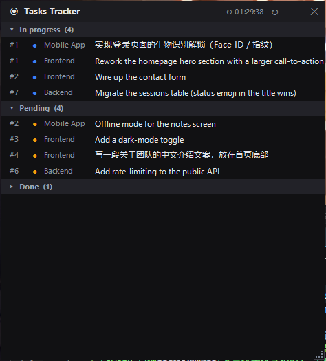

# Tasks Tracker

> A tiny, always-on-top floating panel for Windows that shows your task list
> parsed live from one or more Markdown files. Edit the file(s) in your editor or
> have an AI update them — the panel refreshes within ~2 seconds. You can also
> **right-click a task to change its status or edit its title**, which is written
> back to the file. It otherwise leaves your files untouched.

It pairs well with an AI workflow: keep a `TASKS.md` per project, tell your AI to
maintain it (see [`PROMPT.md`](PROMPT.md)), and glance at this panel in a screen
corner to see what's in progress / pending / done across all your projects.



## What it shows

- A dark, compact list grouped into collapsible sections, ordered **🔄 In progress**
  → **⏳ Pending** → **✅ Done**. Each header shows its count, e.g. `▾ In progress (7)`.
- Each row: `#id` · colored **status dot** (blue / amber / green) · one **tag
  column per nesting level** · the task **title**. Nest your file as deep as you
  like (status → area → sub-area → … → task); each intermediate level becomes a
  column. A task with fewer levels leaves the trailing columns blank.
- **Filters:** a row of dropdowns (one per nesting level) sits under the title
  bar — pick a value to show only matching tasks. Options are whatever appears at
  that level.
- **Multiple files / projects** are merged into the same status groups; each row's
  tag columns tell you which project / area it belongs to.
- **Done** is collapsed by default. **Click a section header** to collapse/expand it.
- The current section's header **stays pinned at the top** while you scroll, so you
  always know which status group you're looking at.
- Long titles are ellipsized; **click a row** to expand the full title (click again
  to collapse). Hovering also shows the full title as a tooltip.
- The top bar shows the last refresh time. Chinese renders in Microsoft YaHei UI,
  English in Segoe UI.

## Requirements

- Windows with **Windows PowerShell 5.1** (built in) — uses WinForms.
- No installation, no dependencies, single script.

## Install

Download / clone the folder anywhere, then double-click:

- **`Start Tasks Tracker.bat`** — opens the panel (no lingering console), **or**
- **`start.vbs`** — same thing with no console window at all.

Or run it directly:

```powershell
powershell -NoProfile -ExecutionPolicy Bypass -Sta -WindowStyle Hidden -File "tasks-panel.ps1"
```

> Start at login: press `Win+R`, type `shell:startup`, and drop a shortcut to
> `start.vbs` into that folder.

## Point it at your tasks

On first run the panel opens a **file picker** — choose one or more task files.
You can change them anytime from the **☰ menu**:

- *Add task file(s)…* — pick one or more Markdown files (multi-select).
- *Remove file ▸* — drop a file from the panel.
- *Open file location ▸* — reveal a file in Explorer.

Your chosen files, window position/size and collapse state are saved in
`config.json` next to the script (per-machine; not shared).

## Task file format

A task file is plain **UTF-8 Markdown**. The full spec + a ready-to-paste prompt
for your AI is in [`PROMPT.md`](PROMPT.md); see [`TASKS.example.md`](TASKS.example.md)
for a working sample. In short:

- **Project name** = file name (without `.md`), unless the file starts with
  `# Project: <name>`.
- **Statuses are defined by a required `## Status legend`** — one status per line;
  the line order is the display order; a line may set a color (`- In progress | #3b82f6`
  or a name). No legend in any file → the panel shows "No status legend found".
- `##` **status sections** group tasks under a legend status (the heading matches
  a status name); auto-color by position when no color is given.
- A **task** is `### #<id> · <title>` (id required; separator `·`, `-`, `:` or a space).
- Any other `#` heading = an optional **category** shown as the row's tag.
- Everything else (notes, `- **File:** …`) is ignored. Tasks outside any status → "Other".

## Usage

- **Drag** the top bar to move; **drag any edge or corner** (or the bottom-right grip) to resize.
- **↻** refresh now · **▴** collapse to title bar · **☰** menu · **✕** close.
- **Click a section header** to collapse/expand it.
- **Click a row** to expand a long title; click again to collapse.
- **☰ menu → Wrap all titles** wraps *every* task title to its full text in one
  click (*Unwrap all titles* collapses them back). The choice is remembered.
- **Right-click a task** → *Edit task…* to rename it, or *Status ▸* to move it to
  another status (or *New status…*, which lets you **pick a color** — a palette
  swatch, a custom color, or *Auto*). The change is written back to that file.
- **☰ menu → Manage statuses…** — a settings dialog to **add, delete, edit
  (name + color), and reorder** all statuses. Deleting a status moves its tasks
  to *no status* (the **Other** group); if it still has tasks you're asked first.
  Changes are written back to your file(s)' `## Status legend`.
- **Collapse to title bar:** click **▴** (or double-click the title bar) to roll
  the window up so only the title bar shows; do it again to expand. The state is
  remembered.

## Updates

When online, the panel checks GitHub for a newer version (it compares a small
`VERSION` file). It checks **on launch**, **once a day**, and on demand via
**☰ menu → Check for updates**. When an update is available a small **dot**
appears in the title bar and a menu item links to the project page (click either
to open it). Checks run in the background and silently no-op when offline.

The window is a tool-window: always on top, hidden from the taskbar / Alt-Tab,
and set to **not steal focus** — clicking it won't pull keyboard focus out of
whatever you're typing in. It re-pins itself above other always-on-top windows
every couple of seconds (paused while a dialog is open), and **auto-hides while a
screen-capture tool** (Snipping Tool, ShareX, Greenshot, …) is in the foreground
so it never blocks what you're capturing — it reappears when you're done.

## System tray

The panel adds a **tray icon** (the ◉ ring). If the panel ever gets covered or
you lose track of it, **click the tray icon** to bring it back to the front and
on-screen. **Right-click** the icon for *Show / bring to front*,
*Collapse / expand*, and *Close panel*.

## How it works

```
  one or more TASKS .md files  (you / your AI edit these)
            |  poll mtime every ~2s; re-parse only on change
            v
   tasks-panel.ps1  (PowerShell + WinForms; read + on-demand write-back)
            |  group by status, tag by project/category
            v
   always-on-top dark panel in a screen corner
```

Reads open with `FileShare.ReadWrite` and tolerate a file being rewritten
(e.g. by an auto-sync task): a locked/partial read just skips that round.

## Files

| File | Purpose |
|---|---|
| `tasks-panel.ps1` | The panel (PowerShell + WinForms, single file). |
| `start.vbs` | No-console launcher. |
| `Start Tasks Tracker.bat` | Double-click launcher. |
| `PROMPT.md` | Format spec + copy-paste prompt for your AI (EN / 中文). |
| `TASKS.example.md` | A working sample task file. |
| `VERSION` | Version number used by the update check. |
| `config.json` | Per-machine state (files, window pos/size, collapse) — auto-created, git-ignored. |

## Notes & limitations

- Windows-only (WinForms). The dark scrollbar uses Windows dark-mode theming;
  on very old builds it falls back to the default scrollbar.
- Writes only on an explicit edit (right-click → Edit/Status, or ☰ → Manage
  statuses); otherwise it never touches your files. Edits are applied in place +
  written back atomically (temp file + copy-overwrite). If a file is auto-synced,
  a panel edit could be overwritten by the sync — edit when sync is idle.
- Statuses are whatever your `## Status legend` declares (any number, any names);
  manage them from ☰ → *Manage statuses…* (add / delete / edit / reorder).
- **Single instance:** launching the panel again closes the previous window and
  keeps only the newest one (tracked via a `panel.pid` stamp next to the script).
- Per-project **filtering** and **drag-to-reorder** directly on the panel are on
  the roadmap.

## License

MIT — see [`LICENSE`](LICENSE).

---

<a name="中文"></a>

# 中文

> 一个极简、常驻置顶的 Windows 悬浮小窗,实时显示从一个或多个 Markdown 文件解析出的
> 任务清单。你在编辑器里改、或让 AI 改文件,面板都会在 ~2 秒内刷新。也可以**右键某个
> 任务改状态或改标题**,改动会写回文件;除此之外不动你的文件。

适合配合 AI 工作流:每个项目放一个 `TASKS.md`,让 AI 按 [`PROMPT.md`](PROMPT.md)
维护它,然后把这个面板挂在屏幕角落,一眼看到所有项目里进行中 / 待办 / 完成的任务。


## 显示什么

- 深色紧凑列表,按状态分**可折叠**段:**🔄 进行中** → **⏳ 待办** → **✅ 完成**,
  每段标题带计数,如 `▾ In progress (7)`。
- 每行:`#编号` · 彩色**状态点**(蓝 / 琥珀 / 绿) · **每个嵌套层级一个标签列** · 任务**标题**。
  文件想嵌多深都行(状态 → 区域 → 子区域 → … → 任务),每个中间层级就是一列;层级少的任务,
  后面的列留空。
- **筛选:** 标题栏下方有一排下拉框(每个嵌套层级一个),选一个值就只显示匹配的任务;
  选项就是该层级出现过的值。
- **多文件 / 多项目**会合并进同一组状态里;每行的标签列告诉你它属于哪个项目 / 区域。
- **完成**默认折叠。**点击段标题**即可折叠/展开。
- 滚动时,当前所在分组的标题会**吸顶固定**,让你随时知道在看哪个状态分组。
- 标题过长会省略;**点击该行**展开完整标题(再点收起),悬停也有完整提示。
- 顶栏显示最后刷新时间。中文用微软雅黑、英文用 Segoe UI 渲染。

## 环境要求

- Windows,自带 **Windows PowerShell 5.1**(基于 WinForms)。
- 免安装、零依赖、单脚本。

## 安装

把文件夹放到任意位置,双击:

- **`Start Tasks Tracker.bat`** —— 打开面板(不留控制台窗口),或
- **`start.vbs`** —— 同上,完全无控制台闪现。

或直接运行:

```powershell
powershell -NoProfile -ExecutionPolicy Bypass -Sta -WindowStyle Hidden -File "tasks-panel.ps1"
```

> 开机自启:`Win+R` 输入 `shell:startup`,把 `start.vbs` 的快捷方式拖进去。

## 指定你的任务文件

首次运行会弹出**文件选择器**,选一个或多个任务文件。之后随时可在 **☰ 菜单**里改:

- *Add task file(s)…* —— 选择一个或多个 Markdown 文件(可多选)。
- *Remove file ▸* —— 从面板移除某个文件。
- *Open file location ▸* —— 在资源管理器中定位文件。

你选的文件、窗口位置/大小、折叠状态都存在脚本旁的 `config.json`(本机私有,不共享)。

## 任务文件格式

任务文件是纯 **UTF-8 Markdown**。完整规范 + 一段可直接贴给 AI 的 prompt 见
[`PROMPT.md`](PROMPT.md);可运行的样例见 [`TASKS.example.md`](TASKS.example.md)。简述:

- **项目名** = 文件名(去掉 `.md`);若文件以 `# Project: <名字>` 开头,则以它为准。
- **状态由必填的 `## Status legend` 定义** —— 每行一个状态;行的顺序即显示顺序;每行可设颜色
  (`- In progress | #3b82f6` 或颜色名)。若没有任何文件含 legend,面板显示「No status legend found」。
- `##` **状态段**把任务归到图例里的某个状态(段标题与状态名匹配);未设颜色时按位置自动配色。
- **任务** 是 `### #<编号> · <标题>`(编号必填;分隔符 `·`、`-`、`:` 或空格)。
- 其他 `#` 标题 = 可选的**分类**,作为该行标签显示。
- 其余内容(笔记、`- **File:** …`)一律忽略;不在任何状态段下的任务归到 **Other**。

## 用法

- **拖**顶栏移动;**拖任意边缘或角**(或右下角小三角)缩放。
- **↻** 立即刷新 · **▴** 折叠成标题栏 · **☰** 菜单 · **✕** 关闭。
- **点击段标题**折叠/展开该段。
- **点击某行**展开长标题,再点收起。
- **☰ 菜单 → Wrap all titles** 一键把*所有*任务标题展开成完整多行(*Unwrap all titles*
  收起);该选择会被记住。
- **右键某个任务** → *Edit task…* 改名,或 *Status ▸* 移到别的状态(或 *New status…*,
  新建时可**选择颜色** —— 调色板色块、自定义颜色,或 *Auto* 自动配色);改动会写回该文件。
- **☰ 菜单 → Manage statuses…** —— 一个设置面板,可**添加、删除、编辑(名字+颜色)、排序**
  所有状态。删除某状态时,它名下的任务会归到**没有状态**(**Other** 组);若该状态仍有任务会先提示。
  改动会写回各文件的 `## Status legend`。
- **折叠成标题栏**:点 **▴**(或双击标题栏)把窗口卷起来只剩标题栏,再点一次展开;
  状态会被记住。

## 更新

联网时,面板会去 GitHub 检查是否有新版本(比对一个很小的 `VERSION` 文件)。检查时机:
**启动时**、**每天一次**、以及 **☰ 菜单 → Check for updates** 手动检查。有更新时,
标题栏会出现一个**小点**,菜单里也会出现指向项目页的条目(点小点或该条目即可打开)。
检查在后台进行,离线时静默跳过。

这是个工具窗口:始终置顶、不出现在任务栏/Alt-Tab、且**不抢焦点** —— 点它不会把你
正在打字的输入焦点抢走。它每隔约两秒会把自己重新置顶到其它置顶窗口之上(有对话框打开时暂停);
并且在**截图工具**(Snipping Tool、ShareX、Greenshot…)处于前台时**自动隐藏**,不挡你要截的内容,
截完会自动再出现。

## 系统托盘

面板会在托盘区放一个**图标**(◉ 圆环)。万一面板被盖住或找不到了,**点托盘图标**就能把它
拉回最前、并移回屏幕内。**右键**图标有 *Show / bring to front*、*Collapse / expand*、
*Close panel*。

## 工作原理

```
  一个或多个 TASKS .md 文件 (你 / 你的 AI 编辑)
            |  每 ~2 秒查一次 mtime;有变化才重新解析
            v
   tasks-panel.ps1  (PowerShell + WinForms;读取 + 按需写回)
            |  按状态分组,按项目/分类打标签
            v
   屏幕角落的常驻置顶深色面板
```

读取用 `FileShare.ReadWrite`,容忍文件被改写(比如 auto-sync):读到锁定/半截就
跳过这一轮、下一轮再读。

## 文件

| 文件 | 作用 |
|---|---|
| `tasks-panel.ps1` | 面板本体(PowerShell + WinForms,单文件)。 |
| `start.vbs` | 无控制台启动器。 |
| `Start Tasks Tracker.bat` | 双击启动器。 |
| `PROMPT.md` | 格式规范 + 给 AI 的现成 prompt(英文 / 中文)。 |
| `TASKS.example.md` | 可运行的样例任务文件。 |
| `VERSION` | 更新检查用的版本号。 |
| `config.json` | 本机状态(文件列表、窗口位置/大小、折叠)—— 自动生成,已 git 忽略。 |

## 说明 / 局限

- 仅 Windows(WinForms)。深色滚动条依赖 Windows 暗色主题,在很老的系统上会回退为
  默认滚动条。
- 仅在你显式编辑时写入(右键 → Edit/Status,或 ☰ → Manage statuses),否则不碰你的文件。
  编辑就地应用并原子写回(临时文件 + 覆盖)。若文件被 auto-sync 同步,面板的改动可能被同步覆盖
  —— 同步空闲时再改。
- 状态由你的 `## Status legend` 决定(任意数量、任意命名);可在 ☰ → *Manage statuses…*
  里管理(添加 / 删除 / 编辑 / 排序)。
- **单实例:** 再次启动面板会自动关掉之前那个,只保留最新的窗口(靠脚本旁的 `panel.pid` 记录)。
- 按项目**筛选**、在面板上直接**拖动排序**已在路线图上。

## 许可证

MIT —— 见 [`LICENSE`](LICENSE)。
